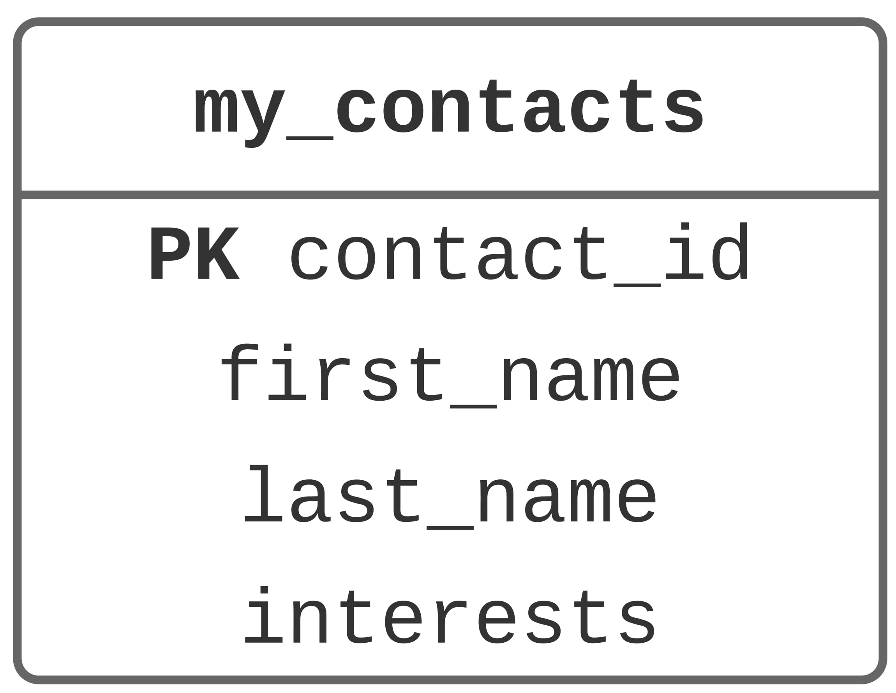
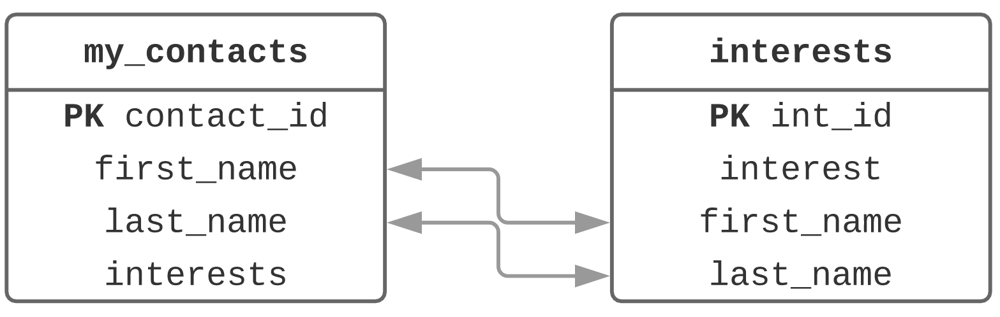
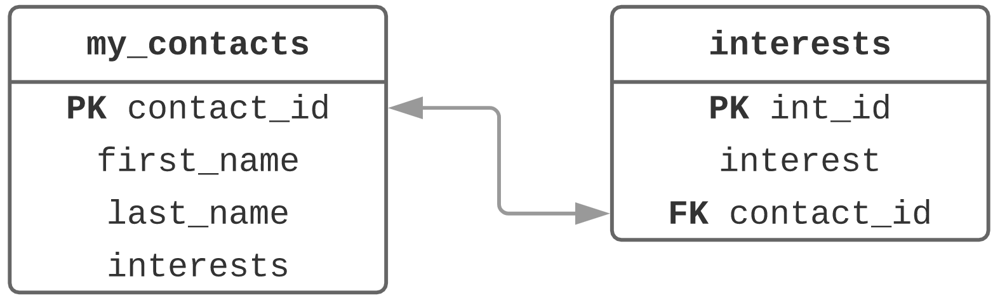

# Database Normalization

## Why Normalize?

* `SELECT` quereies will run faster becasue your database will be optimized.
* Eliminating the redundant storage of information eliminate the following anomalies:
    - **Update Anomalies** Because data is not stored in multiple places in your database, you will not have update anomalies where you update the data in one place but not another.
    - **Delete Anomalies** Delete anomalies will be eliminated because deletions will be propagated through the tables of your database.
    - **Insert Anomalies** You won't find yourself in a place where you are unable to insert data into your database.

## First Normal Form

1. The data is each cell of the tables in your database must be atomic.
2. You cannot have multiple columns in a table holding the same type of data.
3. Each record in a table must be unique. Generally, you find or create a primary key to uniquely identify the rows in your table.

> ##### Atomic Data: Data in its most basic form.


## Second Normal Form

1. Your database must be in 1NF.
2. The tables in your database cannot contain any partial functional dependencies.

## Third Normal Form

1. Your database must be in 2NF.
2. There cannot be any transitive functional dependencies.

# Multi-Table Database Design

>A single table can be redundent, a waste of space, make for slow queries. To properly be able to control data, multiple tables are needed.

**Sometimes non-atomic columns must be moved to new table.**

## Database Schema

The representation of all the tables and columns in a database, as well as how they connect, is called the **schema**

Creating a visual representation (ER Diagram) can be a useful way to see how tables connect.

#### Ex. Going from One Table to Two

Suppose you have the following table:



Since `interests` may list more than one thing, it would be smart to pull `interests` out of the `my_contacts` and place it into a new `intrests` table.

**What would this new table have?** Well, obviously an **`interest`** column, and since we want first normal form, it will need a primary key, which we'll call, **`int_id`**. We also need a way to link the two tables. One way is to use **`first_name`** and **`last_name`**. So the two tables will look something like this:



Now to query the `interests` table we would need to write the folowing `SELECT` statement:

``` SQL
SELECT interest
FROM interests
WHERE first_name = 'SomeFirstName'
AND last_name = 'SomeLastName'
```

This is incredibly inneficient, and it does not account for the possibility that perhaps two people have the same first and last name. To fix this problem, we need a unique way to identify who has what interests. Well, since we have already started normalizing, we have a unique way to identify people: the primary key in `my_contacts`. We can use that key in the `interests` table to reference unique people. This is called a **foreign key**.

## Foreign Keys

> A column in a table that references the *primary key* of another table.

Editing the before example, we now get these two tables:



#### Facts of the Foreign Key

- A foreign hey can have a different name than the primary key it references.
- The primary key used by a foreign key is called the *parent key*. The table of the primary key is called the *parent table*.
- The foreign key can be used to make sure that the rows in one table have corresponding rows in another table.
- Foreign key values can be null, even though primary keys cannot be.
- Foreign keys don't have to be unique, in fact they usually aren't.

#### Null Foreign Keys

If a foreign key is `NULL` it means that there is no matching primary key in the parent table. 

But we can make sure that a foreign key contains a meaningful value, one that exists in the parent table by using a constraint. 

### Referential Integrity

> Only being able to insert values into your foreign key that exist in the parent table.

Simply adding a column and assuming it is a foreign key does not actually make a column a foreign key. It has to be designated as such when you `CREATE` or `ALTER` a table. The key is created inside a structure called a **constraint**. 

Creating a foreign key as a constraint in your table gives you definite advantages: you'll get an error if you violate the rules, which will stop you from breaking the table. 

You can also use foreign keys to reference any unique value in the parent table, not just the primary key.

### Code to Create a Foreign Key

``` SQL
CREATE TABLE interests (
int_id INT NOT NULL AUTO_INCRAMENT PRIMARY_KEY,
interest VARCHAR(50) NOT NULL,
contact_id INT NOT NULL,
CONSTRAINT my_contacts_contact_id_fk, 
FOREIGN KEY (contact_id)
REFERENCES my_contacts (contact_id)
);
```

## Relationships Between Tables

Being able to connect tables are one thing, but understanding how they relate 

### One-to-One Relationships

> Exactly one row of a parent table is related to one row of a child table.

#### When to use one-to-one tables

It usually makes more sense to leave one-to-one data in your main table, but there are some advantages:

1. Pulling the data out may allow you to write faster queries.
2. For columns containing still unkown data, you can isolate it and avoid `NULL` values in your main table.
3. Isolating data can allow you to restrict access to it. 
4. For larger data, a BLOB type for example, you may want that data in a separate table.

### One-to-Many Relationships

> A record in Table A can have **many** matching records in Table B, but a record in Table B can only match **one** record in Table A.

### Many-to-Many Relationships

## Functional Dependencies


### Partial Functional Dependency

A **partial functional dependency** means that a non-key column is dependent on some, but not all, of the columns in a composite key.

### Transitive Functional Dependency

A **transitive functional dependency** is when any non-key column is related to any of the other non-key columns.

If changing any of the non-key columns might cause any other columns to change, you have a transitive dependency.
